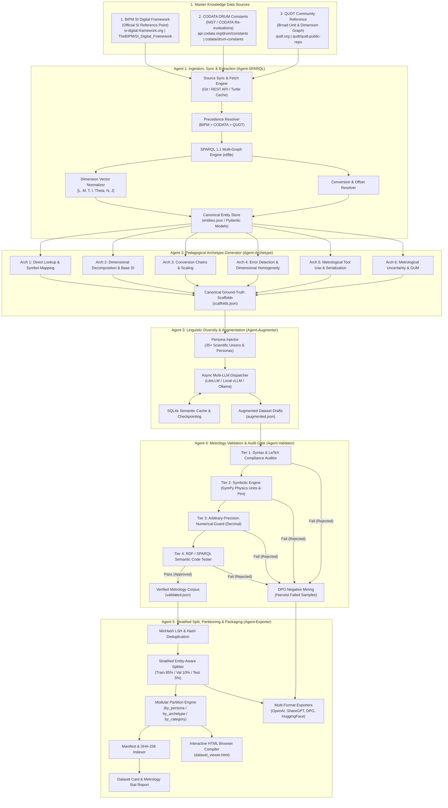

# Metrology & RDF-to-LLM Dataset Generation Agent Specification (`AGENTS.md`)

## 1. Project Overview & Objectives

The **DRUM-ML** (*Digital Representation of Units of Measurement for Machine Learning*) pipeline is an open scientific initiative developed under the **CODATA DRUM ([Digital Representation of Units of Measurement](https://drum.codata.org)) Working Group**, led by **Pascal Heus** (`pascal@codata.org` / `drum@codata.org`).

It is an end-to-end, multi-agent autonomous framework designed to extract, synthesize, augment, validate, and package structured metrological knowledge into high-fidelity fine-tuning datasets for Large Language Models (LLMs).

### 1.1 Master Authoritative Knowledge Sources
The pipeline ingests, reconciles, and aligns against three primary master knowledge repositories:

1. **The SI Reference Point (BIPM SI Digital Framework)**: The official digital representation of the International System of Units (SI) maintained by the BIPM (Bureau International des Poids et Mesures).
   - **Home**: [https://si-digital-framework.org/SI](https://si-digital-framework.org/SI)
   - **API / Swagger UI**: [https://si-digital-framework.org/webjars/swagger-ui/index.html](https://si-digital-framework.org/webjars/swagger-ui/index.html)
   - **GitHub**: [https://github.com/TheBIPM/SI_Digital_Framework](https://github.com/TheBIPM/SI_Digital_Framework)
   - **Artifacts**: Official SI core ontology, defining constants ($c, h, e, k, N_{\text{A}}, \Delta\nu_{\text{Cs}}, K_{\text{cd}}$), base units, prefixes, and coherent derived units in RDF Turtle (`.ttl`) and JSON-LD.

2. **The CODATA Fundamental Constants Project (DRUM Constants)**: The digital version of the official physical constants values published by NIST and recommended by CODATA, capturing versioned historical changes over time (1969–2022).
   - **GitHub**: [https://github.com/codata/drum-constants](https://github.com/codata/drum-constants)
   - **API**: [https://api.codata.org/drum/constants](https://api.codata.org/drum/constants)
   - **Artifacts**: CODATA constants in RDF/Turtle and JSON-LD with standard uncertainties ($u$), relative uncertainties ($u_r$), correlation coefficients, and exact SI 2019 defining constant flags.

3. **QUDT (Quantities, Units, Dimensions, and Types)**: The broad semantic web community reference ontology for units, quantity kinds, dimensions, conversion multipliers, and offset formulas.
   - **Home**: [https://qudt.org/](https://qudt.org/)
   - **GitHub**: [https://github.com/qudt/qudt-public-repo](https://github.com/qudt/qudt-public-repo)
   - **Artifacts**: Comprehensive vocabulary files (`qudt-units.ttl`, `qudt-quantitykinds.ttl`, `qudt-dimensions.ttl`, `qudt-prefixes.ttl`).

### 1.2 Standards & Precedence Hierarchy
When entity definitions or conversion factors overlap, the pipeline enforces the following strict precedence hierarchy:
1. **Tier 1 (Ultimate Ground Truth):** BIPM SI Digital Framework (Official SI Brochure, 9th Edition, 2019 Revision).
2. **Tier 2 (Official Physical Constants):** CODATA DRUM Constants (2018/2022 Re-evaluations & NIST SP 330/811).
3. **Tier 3 (Broad Semantic Graph):** QUDT 2.1 (Non-SI units, legacy units, UCUM mappings, and domain-specific quantity kinds).

### 1.3 Downstream LLM Targets & Primary Deliverables
The project produces three core deliverables:
1. **Open-Access Hugging Face Dataset (`drum-ml/metrology-instruct`):**
   - **Supervised Fine-Tuning (SFT) Split:** Multi-turn conversational JSONL (`OpenAI`, `ShareGPT`, `Anthropic`).
   - **Direct Preference Optimization (DPO) Split:** Mined preference pairs (`prompt`, `chosen`, `rejected`) harvested directly from validation gate audit failures.
   - **Modular Grouped Partitions:** Granular subsets by persona (`by_persona/` across 35+ scientific unions), by pedagogical archetype (`by_archetype/` across 6 core tasks), and by entity category (`by_category/`).
   - **Dataset Manifest & Integrity Index:** `manifest.json` capturing file byte sizes, record counts, token distributions, and SHA-256 integrity checksums.
   - **Interactive HTML Dataset Explorer:** Zero-dependency standalone browser (`dataset_viewer.html`) with KaTeX math rendering, search, multi-format inspection, and DPO comparison arena.
   - **Pre-training Metrological Corpus:** Synthesized JSON-LD, RDF Turtle triples, and metrological reference texts.
2. **M-Eval Metrology Benchmark Suite:**
   - Standardized held-out evaluation testbed to score frontier and domain-adapted LLMs on metrological precision.
   - **Dual-format grading:** Deterministic MCQ/JSON rule-checks for zero-hallucination verification + symbolic free-form validation (SymPy & Pint).
   - **Interactive Benchmark Browser:** Standalone visual explorer (`benchmark_viewer.html`) for task filtering, distractor inspection, and distractor rationale review.
3. **`drum-ml` Python Package & CLI (PyPI & GitHub):**
   - Autonomous CLI for continuous dataset generation, custom ontology synthesis, dataset partitioning, interactive browsing, and benchmark execution.

---

## 2. Multi-Agent Pipeline Architecture



---

## 3. Directory Layout & Module Organization

```
drum-ml/
├── AGENTS.md                          # Comprehensive Agent & Architecture Specification
├── README.md                          # Project overview, installation, quickstart
├── pyproject.toml                     # Package dependencies, build config, tools
├── config.yaml                        # Default pipeline runtime configuration
├── data/
│   ├── raw/                           # Raw RDF ontologies partitioned by master source
│   │   ├── bipm/                      # BIPM SI Digital Framework TTLs
│   │   │   ├── si-core.ttl
│   │   │   ├── si-prefixes.ttl
│   │   │   └── si-constants.ttl
│   │   ├── codata/                    # CODATA DRUM Constants TTLs & JSON
│   │   │   ├── codata-constants.ttl
│   │   │   └── codata-history.json
│   │   └── qudt/                      # QUDT 2.1 Vocabulary TTLs
│   │       ├── qudt-units.ttl
│   │       ├── qudt-quantitykinds.ttl
│   │       ├── qudt-dimensions.ttl
│   │       └── qudt-prefixes.ttl
│   └── cache/                         # SQLite cache for LLM queries and intermediate artifacts
├── dataset/                           # Final generated dataset splits & modular partitions
│   ├── train.jsonl                    # Supervised Fine-Tuning (SFT) Master Train Split (85%)
│   ├── val.jsonl                      # Master Validation Split (10%)
│   ├── test.jsonl                     # Held-out Test Split (5%)
│   ├── dpo_preferences.jsonl          # Direct Preference Optimization (DPO) pairs
│   ├── manifest.json                  # Master manifest with byte sizes, counts, and SHA-256 hashes
│   ├── dataset_viewer.html            # Standalone Interactive HTML Dataset Browser
│   ├── by_persona/                    # 35+ Individual Scientific Union & Domain subsets
│   │   ├── academic_metrologist.jsonl
│   │   ├── academic_metrologist_train.jsonl
│   │   ├── iupap_physicist_train.jsonl
│   │   └── ...
│   ├── by_archetype/                  # 6 Pedagogical Metrology Archetype subsets
│   │   ├── direct_identification.jsonl
│   │   ├── dimensional_decomposition.jsonl
│   │   ├── conversion_scaling.jsonl
│   │   ├── error_detection.jsonl
│   │   ├── semantic_tool_use.jsonl
│   │   └── metrological_uncertainty.jsonl
│   ├── by_category/                   # Physical Entity Category Subsets
│   │   ├── units.jsonl                # Units definitions, dimensions, & conversions
│   │   └── constants.jsonl            # Physical constants & uncertainty budgets
│   ├── benchmark/                     # Standardized DRUM Benchmark splits
│   │   ├── drum_benchmark_mcq.jsonl   # Track A: 4-Option MCQ benchmark
│   │   ├── drum_benchmark_open.jsonl  # Track B: Free-form symbolic benchmark
│   │   ├── drum_benchmark_all.jsonl   # Full benchmark suite
│   │   └── benchmark_viewer.html      # Interactive Benchmark Browser Dashboard
│   └── dataset_card.md                # Generated Hugging Face dataset card & distributions
├── tasks/                             # EleutherAI lm-evaluation-harness configs
│   └── drum_benchmark/                # Master group & 6 subtask YAML definitions
├── src/
│   └── drum_ml/
│       ├── __init__.py
│       ├── cli.py                     # Central Typer CLI entrypoint
│       ├── config.py                  # Pydantic Settings and YAML loader
│       ├── dataset_viewer.py          # Standalone Interactive HTML Dataset Browser generator
│       ├── benchmark/                 # Benchmark Models, Gold Test Generator & Viewer
│       │   ├── __init__.py
│       │   ├── generator.py           # Benchmark question generator
│       │   ├── models.py              # Benchmark Pydantic schemas
│       │   └── viewer.py              # Interactive HTML Benchmark Viewer generator
│       ├── data_sources/              # Source fetchers and sync clients
│       │   ├── __init__.py
│       │   ├── bipm_client.py         # BIPM SI API & Git fetcher
│       │   ├── codata_client.py       # CODATA DRUM REST API client
│       │   └── qudt_fetcher.py        # QUDT GitHub release downloader
│       ├── models/                    # Pydantic Data Models & Types
│       │   ├── __init__.py
│       │   ├── entities.py            # Unit, Quantity, Constant, Dimension models
│       │   ├── scaffolds.py           # Archetype instruction-response scaffold models
│       │   ├── augmented.py           # Augmented sample models with persona metadata
│       │   ├── validation.py          # Validation report & audit failure models
│       │   └── export.py              # OpenAI, ShareGPT, DPO format schemas
│       ├── pipeline/
│       │   ├── __init__.py
│       │   ├── extractor.py           # Agent 1: SPARQL Ingestion & RDF parsing
│       │   ├── scaffolder.py          # Agent 2: Archetype pedagogical generation
│       │   ├── augmenter.py           # Agent 3: Linguistic diversity & persona generation
│       │   ├── validator.py           # Agent 4: Symbolic & deterministic validation gate
│       │   ├── dpo_miner.py           # Agent 4b: DPO Preference pair extractor
│       │   ├── exporter.py            # Agent 5: Deduplication, partitioning, and packaging
│       │   └── evaluator.py           # Benchmark evaluator & scorecard generator
│       ├── symbolic/
│       │   ├── __init__.py
│       │   ├── dimensions.py          # SI 7-base dimension vector arithmetic
│       │   ├── latex_verifier.py      # LaTeX syntax, math balance, symbol checks
│       │   ├── pint_engine.py         # Pint & SymPy algebraic equivalence verifier
│       │   └── precision.py           # Arbitrary-precision exact SI constant verifier
│       └── prompts/
│           ├── __init__.py
│           ├── templates_archetypes.py# Base ground-truth response templates
│           └── templates_personas.py  # Persona system prompts and diversity seeds
└── tests/
    ├── test_extractor.py              # RDF parsing and SPARQL extraction tests
    ├── test_dimensions.py             # Symbolic dimension arithmetic tests
    ├── test_scaffolder.py             # Archetype generation tests
    ├── test_validator.py              # Validation gate rule checks
    ├── test_exporter.py               # Splitting & export formatting tests
    ├── test_dataset_viewer.py         # Interactive HTML dataset browser tests
    ├── test_benchmark_viewer.py       # Interactive HTML benchmark browser tests
    └── test_end_to_end.py             # Full pipeline integration tests
```

---

## 4. Formal Data Contracts & Pydantic Schemas

### 4.1 Canonical Metrological Entities (`drum_ml.models.entities`)

```python
from enum import Enum
from typing import Dict, List, Optional
from pydantic import BaseModel, Field, HttpUrl


class BaseDimension(str, Enum):
    LENGTH = "L"  # Length (meter, m)
    MASS = "M"  # Mass (kilogram, kg)
    TIME = "T"  # Time (second, s)
    ELECTRIC_CURRENT = "I"  # Electric Current (ampere, A)
    THERMODYNAMIC_TEMP = "Theta"  # Thermodynamic Temperature (kelvin, K)
    AMOUNT_OF_SUBSTANCE = "N"  # Amount of Substance (mole, mol)
    LUMINOUS_INTENSITY = "J"  # Luminous Intensity (candela, cd)


class DimensionVector(BaseModel):
    """SI base dimensional representation [L, M, T, I, Theta, N, J] with integer/rational powers."""

    L: int = 0
    M: int = 0
    T: int = 0
    I: int = 0
    Theta: int = 0
    N: int = 0
    J: int = 0

    def to_latex(self) -> str:
        """Returns LaTeX dimension formula, e.g., \\text{L}\\cdot\\text{M}\\cdot\\text{T}^{-2}"""
        terms = []
        symbol_map = {
            "L": "L",
            "M": "M",
            "T": "T",
            "I": "I",
            "Theta": "\\Theta",
            "N": "N",
            "J": "J",
        }
        for dim, power in self.model_dump().items():
            if power == 1:
                terms.append(f"\\text{{{symbol_map[dim]}}}")
            elif power != 0:
                terms.append(f"\\text{{{symbol_map[dim]}}}^{{{power}}}")
        return " \\cdot ".join(terms) if terms else "\\text{dimensionless}"

    def to_si_base_unit_latex(self) -> str:
        """Returns SI base unit formula, e.g., \\text{kg}\\cdot\\text{m}\\cdot\\text{s}^{-2}"""
        unit_map = {"M": "kg", "L": "m", "T": "s", "I": "A", "Theta": "K", "N": "mol", "J": "cd"}
        terms = []
        # Standard metrology order: kg, m, s, A, K, mol, cd
        order = ["M", "L", "T", "I", "Theta", "N", "J"]
        for dim in order:
            power = getattr(self, dim)
            if power == 1:
                terms.append(f"\\text{{{unit_map[dim]}}}")
            elif power != 0:
                terms.append(f"\\text{{{unit_map[dim]}}}^{{{power}}}")
        return " \\cdot ".join(terms) if terms else "1"


class QuantityKindEntity(BaseModel):
    """VIM3 Quantity Kind: An abstract physical property (e.g., Torque, Energy, Absorbed Dose)."""

    uri: str
    label: str
    symbol: Optional[str] = None
    description: Optional[str] = None
    dimension_vector: DimensionVector
    applicable_units: List[str] = Field(default_factory=list)  # Unit URIs
    broader_quantity_kinds: List[str] = Field(default_factory=list)
    exact_match_uris: List[str] = Field(default_factory=list)


class ConversionRelation(BaseModel):
    """Conversion relationship from non-SI / derived unit to SI base unit: SI_val = (val * multiplier) + offset."""

    multiplier: float
    offset: float = 0.0
    exact: bool = False
    conversion_formula: Optional[str] = None  # e.g. "T_{K} = (T_{^{\circ}F} - 32) * 5/9 + 273.15"


class UnitEntity(BaseModel):
    uri: str
    symbol: str
    label: str
    description: Optional[str] = None
    is_si_base: bool = False
    is_si_derived: bool = False
    is_coherent: bool = True
    dimension_vector: DimensionVector
    has_quantity_kinds: List[str] = Field(default_factory=list)
    ucum_code: Optional[str] = None
    conversion: Optional[ConversionRelation] = None
    iec_symbol: Optional[str] = None
    latex_symbol: Optional[str] = None
    exact_match_uris: List[str] = Field(default_factory=list)


class ConstantCategory(str, Enum):
    EXACT_SI_DEFINING = "exact_si_defining"  # e.g., c, h, e, k, N_A, Delta_nu_Cs, K_cd
    CODATA_RECOMMENDED = "codata_recommended"  # e.g., G, alpha, m_e with uncertainty


class PhysicalConstantEntity(BaseModel):
    uri: str
    name: str
    symbol: str
    latex_symbol: str
    category: ConstantCategory
    numeric_value: str  # String representation to preserve exact arbitrary precision
    standard_uncertainty: Optional[str] = None  # None for exact defining constants
    relative_uncertainty: Optional[str] = None
    unit_symbol: str
    unit_uri: Optional[str] = None
    dimension_vector: DimensionVector
    defining_year: int = 2019
    description: Optional[str] = None
```

### 4.2 Intermediate Scaffolds & Validation Schemas (`drum_ml.models.scaffolds`, `drum_ml.models.validation`)

```python
class ArchetypeType(str, Enum):
    DIRECT_IDENTIFICATION = "direct_identification"  # Symbol <-> Name, Quantity <-> SI Unit
    DIMENSIONAL_DECOMPOSITION = "dimensional_decomposition"  # Base SI decomposition & derivation
    CONVERSION_SCALING = "conversion_scaling"  # Multipliers, offsets, compound units
    DIMENSIONAL_ERROR_DETECTION = (
        "error_detection"  # Homogeneity violation, invalid sum, bad prefix
    )
    SEMANTIC_TOOL_USE = "semantic_tool_use"  # SPARQL, QUDT queries, Pint code execution
    METROLOGICAL_UNCERTAINTY = "metrological_uncertainty"  # GUM uncertainty propagation, sig-figs


class PersonaType(str, Enum):
    ACADEMIC_METROLOGIST = "academic_metrologist"
    FIRMWARE_IOT_ENGINEER = "firmware_iot_engineer"
    DATA_SCIENTIST_ANALYST = "data_scientist_analyst"
    PHYSICS_STUDENT = "physics_student"
    ISO_COMPLIANCE_AUDITOR = "iso_compliance_auditor"


class DifficultyTier(str, Enum):
    INTRODUCTORY = "introductory"  # High school / basic lookup
    INTERMEDIATE = "intermediate"  # Undergraduate physics / engineering calculation
    ADVANCED = "advanced"  # Formal metrology / standards lab level


class ScaffoldRecord(BaseModel):
    id: str
    archetype: ArchetypeType
    entity_uri: str
    ground_truth_answer: str
    canonical_query: str
    context_facts: Dict[str, str] = Field(default_factory=dict)
    latex_expressions: List[str] = Field(default_factory=list)
    numerical_constants: Dict[str, str] = Field(default_factory=dict)
    difficulty: DifficultyTier = DifficultyTier.INTERMEDIATE


class AugmentedRecord(BaseModel):
    id: str
    scaffold_id: str
    archetype: ArchetypeType
    persona: PersonaType
    user_query: str
    ground_truth_answer: str
    entity_uri: str
    temperature: float = 0.7
    llm_generator: str


class ValidationResult(BaseModel):
    record_id: str
    passed: bool
    latex_valid: bool
    symbolic_dimensions_valid: bool
    numeric_precision_exact: bool
    sparql_code_valid: bool
    failure_reasons: List[str] = Field(default_factory=list)
    corrected_response: Optional[str] = None
```

### 4.3 Target Dataset Schemas (`drum_ml.models.export`)

```python
class OpenAIChatMessage(BaseModel):
    role: str  # "system" | "user" | "assistant"
    content: str


class OpenAIChatRecord(BaseModel):
    id: str
    archetype: ArchetypeType
    entity_uri: str
    messages: List[OpenAIChatMessage]


class DPOPreferenceRecord(BaseModel):
    id: str
    archetype: ArchetypeType
    entity_uri: str
    prompt: str
    chosen: str
    rejected: str
    rejection_reason: str
```

---

## 5. Detailed Agent Specifications & Implementation Blueprints

### 5.1 Agent 1: SPARQL Ingestion & Canonical Extraction (`drum_ml.pipeline.extractor` & `drum_ml.data_sources`)

- **Objective:** Ingest, synchronize, and parse triples from the three master knowledge sources (BIPM SI Digital Framework, CODATA DRUM Constants, and QUDT 2.1), normalize dimension vectors, resolve conversion factors and temperature offsets, and serialize canonical entities into structured Pydantic models with provenance metadata.

#### 5.1.1 Master Data Fetchers (`drum_ml.data_sources`)
1. **BIPM Client (`bipm_client.py`):**
   - Clones or downloads TTL files from [TheBIPM/SI_Digital_Framework](https://github.com/TheBIPM/SI_Digital_Framework) (`ontology/si-core.ttl`, `prefixes`, `constants`).
   - Queries REST API / Swagger endpoints at [https://si-digital-framework.org/webjars/swagger-ui/index.html](https://si-digital-framework.org/webjars/swagger-ui/index.html) for dynamic term lookup and JSON-LD contexts.
2. **CODATA DRUM Client (`codata_client.py`):**
   - Fetches historical and current fundamental constant values from [https://api.codata.org/drum/constants](https://api.codata.org/drum/constants).
   - Ingests TTL and JSON releases from [codata/drum-constants](https://github.com/codata/drum-constants) to capture uncertainty budgets and defining-year metadata.
3. **QUDT Downloader (`qudt_fetcher.py`):**
   - Pulls official TTL vocabulary releases from [qudt/qudt-public-repo](https://github.com/qudt/qudt-public-repo) (`vocab/unit/VOCAB_QUDT-UNITS-ALL.ttl`, `vocab/quantitykind/`, `vocab/dimension/`, `vocab/prefix/`).

#### 5.1.2 Multi-Graph Alignment & SPARQL Queries
The extractor initializes an `rdflib.ConjunctiveGraph` and binds namespaces:
```python
PREFIX si: <https://si-digital-framework.org/SI/ontology/>
PREFIX codata: <https://codata.org/constants/ontology/>
PREFIX qudt: <http://qudt.org/schema/qudt/>
PREFIX unit: <http://qudt.org/vocab/unit/>
PREFIX qk: <http://qudt.org/vocab/quantitykind/>
PREFIX rdfs: <http://www.w3.org/2000/01/rdf-schema#>
PREFIX skos: <http://www.w3.org/2004/02/skos/core#>
```

```sparql
# Query 1: Extract Units, Quantity Kinds, Dimensions, Conversion Multipliers (QUDT & BIPM aligned)
SELECT DISTINCT ?unit ?symbol ?label ?description ?conversionMultiplier ?conversionOffset
                ?isCoherent ?isSiBase ?ucumCode ?iecCode ?dimVector ?dimL ?dimM ?dimT ?dimI ?dimTheta ?dimN ?dimJ ?source
WHERE {
  ?unit a qudt:Unit ;
        rdfs:label ?label .
  OPTIONAL { ?unit qudt:symbol ?symbol }
  OPTIONAL { ?unit qudt:description ?description }
  OPTIONAL { ?unit qudt:conversionMultiplier ?conversionMultiplier }
  OPTIONAL { ?unit qudt:conversionOffset ?conversionOffset }
  OPTIONAL { ?unit qudt:isCoherent ?isCoherent }
  OPTIONAL { ?unit qudt:isSI ?isSiBase }
  OPTIONAL { ?unit qudt:ucumCode ?ucumCode }
  OPTIONAL { ?unit qudt:iec61360Code ?iecCode }
  OPTIONAL {
    ?unit qudt:hasDimensionVector ?dimVector .
    OPTIONAL { ?dimVector qudt:dimensionExponentForLength ?dimL }
    OPTIONAL { ?dimVector qudt:dimensionExponentForMass ?dimM }
    OPTIONAL { ?dimVector qudt:dimensionExponentForTime ?dimT }
    OPTIONAL { ?dimVector qudt:dimensionExponentForElectricCurrent ?dimI }
    OPTIONAL { ?dimVector qudt:dimensionExponentForThermodynamicTemperature ?dimTheta }
    OPTIONAL { ?dimVector qudt:dimensionExponentForAmountOfSubstance ?dimN }
    OPTIONAL { ?dimVector qudt:dimensionExponentForLuminousIntensity ?dimJ }
  }
  BIND("QUDT_2.1" AS ?source)
}
```

```sparql
# Query 2: Extract CODATA & BIPM Fundamental Physical Constants
SELECT DISTINCT ?constant ?name ?symbol ?latexSymbol ?numericValue ?stdUncertainty ?relUncertainty ?unit ?unitSymbol ?isExact ?year
WHERE {
  ?constant a qudt:PhysicalConstant ;
            rdfs:label ?name ;
            qudt:symbol ?symbol ;
            qudt:numericValue ?numericValue .
  OPTIONAL { ?constant qudt:latexSymbol ?latexSymbol }
  OPTIONAL { ?constant qudt:standardUncertainty ?stdUncertainty }
  OPTIONAL { ?constant qudt:relativeUncertainty ?relUncertainty }
  OPTIONAL { ?constant qudt:unit ?unit . ?unit qudt:symbol ?unitSymbol }
  OPTIONAL { ?constant qudt:isExact ?isExact }
  OPTIONAL { ?constant qudt:definingYear ?year }
}
```

- **Special Cases & Metrological Invariants:**
  1. **Affine / Temperature Units:** Celsius ($T_{\text{K}} = T_{^{\circ}\text{C}} + 273.15$), Fahrenheit ($T_{\text{K}} = (T_{^{\circ}\text{F}} + 459.67) \times \frac{5}{9}$), Rankine ($T_{\text{K}} = T_{\text{R}} \times \frac{5}{9}$).
  2. **Logarithmic / Dimensionless Units:** Decibel ($\text{dB}$), Neper ($\text{Np}$), radian ($\text{rad} = \text{m}\cdot\text{m}^{-1}$), steradian ($\text{sr} = \text{m}^2\cdot\text{m}^{-2}$), part-per-million ($\text{ppm} = 10^{-6}$).
  3. **SI Exact Defining Constants (2019 BIPM Reference Point):**
     - Speed of light: $c = 299\,792\,458\text{ m/s}$ (exact)
     - Planck constant: $h = 6.626\,070\,15 \times 10^{-34}\text{ J}\cdot\text{s}$ (exact)
     - Elementary charge: $e = 1.602\,176\,634 \times 10^{-19}\text{ C}$ (exact)
     - Boltzmann constant: $k = 1.380\,649 \times 10^{-23}\text{ J/K}$ (exact)
     - Avogadro constant: $N_{\text{A}} = 6.022\,140\,76 \times 10^{23}\text{ mol}^{-1}$ (exact)
     - Hyperfine transition frequency of $^{133}\text{Cs}$: $\Delta\nu_{\text{Cs}} = 9\,192\,631\,770\text{ Hz}$ (exact)
     - Luminous efficacy: $K_{\text{cd}} = 683\text{ lm/W}$ (exact)

---

### 5.2 Agent 2: Pedagogical Archetype Generator (`drum_ml.pipeline.scaffolder`)

- **Objective:** For every extracted entity, generate deterministic, rigorous instruction-response scaffolds across 6 core metrological archetypes. Ground all solutions in formal metrological proofs and strict LaTeX.

#### Archetype 1: Direct Identification & Lookup
- **Patterns:**
  - Forward: "Given unit name $U$, state its official SI/QUDT symbol, quantity kind, and status."
  - Reverse: "Given symbol $S$, identify the unit, dimension, and definition."
  - Constant: "Provide the exact/CODATA recommended value and uncertainty of constant $C$."
- **Example Ground-Truth:**
  - *User:* "What is the official SI symbol and quantity kind for the unit **pascal**?"
  - *Assistant:* "The official SI symbol for the **pascal** is $\\text{Pa}$. It is the coherent derived unit for **pressure** and **stress** (Quantity Kind: `qudt:Pressure`, `qudt:Stress`). In terms of SI derived units with special names, $1\\text{ Pa} = 1\\text{ N/m}^2$."

#### Archetype 2: Dimensional Decomposition & Base SI Analysis
- **Patterns:**
  - Decompose derived unit into base SI dimensions $[L]^a [M]^b [T]^c [I]^d [\Theta]^e [N]^f [J]^g$.
  - Step-by-step physical equation derivation (e.g., $E = h\nu \implies [h] = [E]/[\nu] = \text{kg}\cdot\text{m}^2\cdot\text{s}^{-1}$).
- **Example Ground-Truth:**
  - *User:* "Derive the SI base unit decomposition of the **joule** ($\\text{J}$)."
  - *Assistant:* "The **joule** (symbol: $\\text{J}$) is the SI coherent derived unit of energy, work, and quantity of heat.\n\nFrom the mechanical work definition $W = F \\cdot d$:\n$$\\text{Work} = \\text{Force} \\times \\text{Distance}$$\nSince $1\\text{ N} = 1\\text{ kg}\\cdot\\text{m}\\cdot\\text{s}^{-2}$, we substitute:\n$$\\text{J} = \\text{N}\\cdot\\text{m} = (\\text{kg}\\cdot\\text{m}\\cdot\\text{s}^{-2}) \\cdot \\text{m} = \\text{kg}\\cdot\\text{m}^2\\cdot\\text{s}^{-2}$$\n\nIn terms of base dimensional symbols:\n$$[\\text{J}] = \\text{M}\\cdot\\text{L}^2\\cdot\\text{T}^{-2}$$"

#### Archetype 3: Conversion Chains, Scaling & Temperature Offsets
- **Patterns:**
  - Compound unit conversion (e.g., $\text{mi/gal} \to \text{L}/100\text{km}$, $\text{g/cm}^3 \to \text{kg/m}^3$, $\text{kWh} \to \text{J}$).
  - Temperature conversions with non-zero offsets ($^{\circ}\text{F} \leftrightarrow ^{\circ}\text{C} \leftrightarrow \text{K}$).
  - Metric prefix composition and cancellations ($\text{nm} \cdot \text{GHz} \to \text{m/s}$).

#### Archetype 4: Dimensional Sanity, Inconsistency & Error Detection
- **Patterns:**
  - Dimensional homogeneity check in physics equations (e.g., $x = v_0 t + \frac{1}{2} a t^3 \to$ flag error $[L] \neq [L][T]$).
  - Invalid additions across incompatible quantity kinds (e.g., adding $10\text{ J} + 5\text{ N}$).
  - Prefix misuse (e.g., double prefixes like $\text{m}\mu\text{m}$, illegal prefix on base kilogram $\text{kkg}$).
  - Case-sensitivity traps ($\text{mN}$ millinewton vs $\text{MN}$ meganewton; $\text{mHz}$ millihertz vs $\text{MHz}$ megahertz; $\text{b}$ bit vs $\text{B}$ byte).

#### Archetype 5: Metrological Tool Use & Semantic Serialization
- **Patterns:**
  - Natural Language $\to$ SPARQL query over QUDT graph.
  - Natural Language $\to$ Python code using `pint` or `sympy.physics.units`.
  - Natural Language $\to$ Valid JSON-LD / Turtle serialization.
- **Example Assistant Code:**
```python
import pint

ureg = pint.UnitRegistry()
force = 10.0 * ureg.newton
area = 2.0 * (ureg.meter**2)
pressure = (force / area).to(ureg.pascal)
print(f"Calculated pressure: {pressure}")
```

#### Archetype 6: Metrological Uncertainty & GUM Propagation
- **Patterns:**
  - Calculate combined standard uncertainty $u_c(y) = \sqrt{\sum \left(\frac{\partial f}{\partial x_i}\right)^2 u^2(x_i)}$ for linear/non-linear relationships.
  - Reporting values with expanded uncertainty $U = k \cdot u_c$ (with coverage factor $k=2$ for 95% confidence).
  - Distinguishing exact SI constants ($u = 0$) from empirical constants (e.g., $G = 6.67430(15) \times 10^{-11}\text{ m}^3\text{kg}^{-1}\text{s}^{-2}$, $u_r = 2.2 \times 10^{-5}$).

---

### 5.3 Agent 3: Linguistic Diversity & Persona Augmentation (`drum_ml.pipeline.augmenter`)

- **Objective:** Expand the canonical instruction scaffolds into 5–10 diverse, natural user prompts per entity-archetype pair using LLM persona injection, without modifying the mathematically grounded assistant answer.
- **Persona Profiles:**
  1. **Academic Metrologist / NIST Researcher:** Formal, rigorous terminology, citing BIPM 9th edition, SI brochure, VIM3 definitions.
  2. **Embedded & Firmware / IoT Engineer:** Pragmatic, telemetry-focused, sensor register reading (e.g., ADC counts $\to \text{mV} \to ^{\circ}\text{C}$), endianness, UCUM strings, microcontroller C structs.
  3. **Data Scientist & ML Engineer:** Dataframe unit normalization, feature engineering, unit-checking in PyTorch/TensorFlow pipelines.
  4. **Undergraduate Physics Student:** Conversational, working through homework, conceptual confusion (e.g., "Why is weight in Newtons if scales show kilograms?").
  5. **ISO / Regulatory Quality Auditor:** ISO 80000 compliance, traceability to national standards, calibration certificates, uncertainty budgeting.

- **Augmenter System Prompt:**

```markdown
You are a Synthetic Data Diversity Specialist for Physical Sciences and Metrology.
Given a canonical metrological entity, archetype, and ground-truth answer, generate {k} distinct, realistic user prompts from different technical perspectives and difficulty tiers.

STRICT INVARIANTS:
1. The ground-truth answer provided MUST remain completely accurate and sufficient for every generated prompt.
2. Vary linguistic register: direct questions, troubleshooting bugs, multi-sentence contextual scenarios, code review queries, homework problems.
3. Preserve all mathematical and case-sensitive symbols exactly (e.g., do not lowercase 'K' for kelvin or uppercase 'm' for milli).
4. Output structured JSON matching the AugmentedRecord schema.
```

- **Async Multi-Provider Engine & Local-First Execution:**
  - **Local-First (Default):** Native support for local inference via **MLX**, **LM Studio**, and **Ollama** (e.g., `qwen3.8:27b-mlx`, `gemma4:12b-mlx`, with seamless model-swapping support) using local OpenAI-compatible endpoints (`http://localhost:11434/v1` or `http://localhost:1234/v1` or native MLX server).
  - **Model Agnostic & Forward-Compatible:** Configurable via `config.yaml` or `--model` CLI flags so local model checkpoints can be updated seamlessly as new model releases become available.
  - **Cloud Multi-Provider (Fallback / Alternative):** Direct support for OpenAI (`gpt-4o-mini`, `gpt-4o`) and Anthropic (`claude-3-5-sonnet`) via LiteLLM.
  - **Persistent SQLite Semantic Cache:** Query hashing via `sha256(canonical_query + archetype + persona)` prevents redundant LLM invocations and guarantees zero-cost resumability on network or power interruptions.

---

### 5.4 Agent 4: Deterministic & Symbolic Validation Gate (`drum_ml.pipeline.validator`)

- **Objective:** Automated, multi-tiered quality gate that deterministically evaluates, audits, and repairs or rejects every generated pair before admission to the training dataset.

```
                      +------------------------------------------+
                      | Raw Generated Prompt-Response Candidate   |
                      +--------------------+---------------------+
                                           |
                                           v
                      +------------------------------------------+
                      | Tier 1: Syntax & LaTeX Compliance Gate   |
                      | - Balanced $ and $$ delimiters            |
                      | - Valid JSONL escaping                   |
                      | - Valid LaTeX command syntax             |
                      +--------------------+---------------------+
                                           | [Pass]
                                           v
                      +------------------------------------------+
                      | Tier 2: Symbolic Dimensional Gate (Pint) |
                      | - Homogeneity check                      |
                      | - Derived == Base SI equivalence check   |
                      | - Algebraic simplifications              |
                      +--------------------+---------------------+
                                           | [Pass]
                                           v
                      +------------------------------------------+
                      | Tier 3: Numerical & SI Constant Guard    |
                      | - Arbitrary precision check (Decimal)    |
                      | - SI 2019 exact constants verification   |
                      | - Conversion factor exactness            |
                      +--------------------+---------------------+
                                           | [Pass]
                                           v
                      +------------------------------------------+
                      | Tier 4: Code & Semantic Execution Gate   |
                      | - SPARQL query syntax check (rdflib)     |
                      | - Python snippet syntax (ast.parse)      |
                      +--------------------+---------------------+
                                           |
                   +-----------------------+-----------------------+
                   |                                               |
                   v [Pass All]                                    v [Any Failure]
       +-----------------------+                       +-----------------------+
       | Admitted to SFT Train |                       | Mined to DPO Rejected |
       | & Benchmark Corpus    |                       | (Negative Sample)     |
       +-----------------------+                       +-----------------------+
```

- **Tier Details:**
  1. **Tier 1 (LaTeX & Syntax):** Uses regex and LaTeX tokenizers to ensure all math expressions are encapsulated, macros (`\text`, `\frac`, `\cdot`) are valid, and characters are correctly escaped.
  2. **Tier 2 (Symbolic Equivalence):** Uses `sympy.physics.units` and `pint` to symbolically verify that every asserted equality (e.g., $1\text{ N} = 1\text{ kg}\cdot\text{m}\cdot\text{s}^{-2}$) is mathematically true.
  3. **Tier 3 (Arbitrary Precision Numerical Guard):** Uses Python `decimal.Decimal` to ensure exact SI values (like $c = 299792458$, $h = 6.62607015 \times 10^{-34}$) are never rounded or truncated without explanation.
  4. **Tier 4 (Code Sandbox):** Emitted SPARQL queries are parsed with `rdflib.plugins.sparql.parser.parseQuery`; emitted Python unit code is verified with Python's `ast.parse` and sandboxed execution.

- **DPO Negative Mining:**
  - Any generated response that fails numerical precision, dimensional balance, or case sensitivity is paired with the corrected ground-truth response as `(prompt, chosen, rejected)` for direct preference fine-tuning.

---

### 5.5 Agent 5: Split, Partitioning & Packaging Agent (`drum_ml.pipeline.exporter` & `drum_ml.dataset_viewer`)

- **Objective:** Deduplicate samples, balance archetype distributions, apply stratified entity-level partitioning to prevent data leakage, generate granular multi-file subsets, compute integrity manifests, and compile standalone interactive HTML dataset browsers.
- **Deduplication Strategy:**
  - Exact match: SHA-256 hash of normalized user query.
  - Semantic match: MinHash LSH with Jaccard distance threshold $< 0.85$ or embedding cosine similarity $< 0.92$.
- **Stratified Partitioning:**
  - Split ratios: **Train: 85%**, **Validation: 10%**, **Test: 5%** (configurable).
  - *Entity-Isolation Guard:* Ensures that all variants of an entity's archetype do not cross the train-test boundary, guaranteeing clean held-out evaluation.
- **Modular Grouped Subsets:**
  - `dataset/by_persona/`: 35+ discrete JSONL files partitioned by international scientific union / domain persona (e.g. `iupap_physicist_train.jsonl`, `iupac_chemist_train.jsonl`, `academic_metrologist_train.jsonl`).
  - `dataset/by_archetype/`: 6 discrete JSONL files partitioned by pedagogical archetype (e.g. `dimensional_decomposition.jsonl`, `conversion_scaling.jsonl`).
  - `dataset/by_category/`: Physical entity category subsets (`units.jsonl`, `constants.jsonl`).
- **Integrity Manifest (`manifest.json`):**
  - Indexes all generated files with exact byte sizes, sample counts, token geometry, and SHA-256 integrity checksums.
- **Interactive HTML Dataset Explorer (`dataset_viewer.html`):**
  - Standalone, zero-dependency browser with KaTeX LaTeX math rendering, instant search, multi-format inspection (Rendered, OpenAI, ShareGPT, Raw JSON), DPO preference arena, persona matrix, and local file drag-and-drop.
- **Export Targets:**
  - `dataset/train.jsonl` (OpenAI format)
  - `dataset/val.jsonl`
  - `dataset/test.jsonl`
  - `dataset/formats/sharegpt/train.jsonl` (ShareGPT format)
  - `dataset/dpo_preferences.jsonl` (DPO format)
  - `dataset/manifest.json`
  - `dataset/dataset_viewer.html`
  - `dataset/dataset_card.md` (Hugging Face compatible dataset card with distribution histograms, unit coverage metrics, token counts).

---

## 6. Runtime Configuration Specification (`config.yaml`)

```yaml
# DRUM-ML Pipeline Master Configuration

project:
  name: "drum-ml-metrology-corpus"
  version: "1.0.0"
  output_dir: "./dataset"
  cache_db: "./data/cache/llm_cache.sqlite"

sources:
  # 1. BIPM SI Digital Framework (Official SI Reference Point)
  bipm:
    enabled: true
    repo_url: "https://github.com/TheBIPM/SI_Digital_Framework"
    api_url: "https://si-digital-framework.org/SI"
    local_dir: "./data/raw/bipm"
    files:
      - "si-core.ttl"
      - "si-prefixes.ttl"
      - "si-constants.ttl"

  # 2. CODATA Fundamental Constants Project (DRUM Constants)
  codata_drum:
    enabled: true
    repo_url: "https://github.com/codata/drum-constants"
    api_url: "https://api.codata.org/drum/constants"
    local_dir: "./data/raw/codata"
    version_evaluations: ["2018", "2022"]
    files:
      - "codata-constants.ttl"
      - "codata-history.json"

  # 3. QUDT 2.1 Community Reference
  qudt:
    enabled: true
    repo_url: "https://github.com/qudt/qudt-public-repo"
    release_tag: "v2.1.37"
    local_dir: "./data/raw/qudt"
    files:
      - "VOCAB_QUDT-UNITS-ALL.ttl"
      - "VOCAB_QUDT-QUANTITY-KINDS-ALL.ttl"
      - "VOCAB_QUDT-DIMENSION-VECTORS-ALL.ttl"
      - "VOCAB_QUDT-PREFIXES-ALL.ttl"

archetypes:
  enabled:
    - "direct_identification"
    - "dimensional_decomposition"
    - "conversion_scaling"
    - "error_detection"
    - "semantic_tool_use"
    - "metrological_uncertainty"
  max_entities_per_archetype: null # null = all entities

augmenter:
  provider: "lm_studio" # "lm_studio" | "ollama" | "mlx" | "openai" | "anthropic" | "vllm"
  model: "qwen3.8:27b-mlx" # or "gemma4:12b-mlx", "gpt-4o-mini"
  api_base: "http://localhost:1234/v1" # or "http://localhost:11434/v1" for Ollama
  temperature: 0.7
  variations_per_archetype: 6
  concurrency_limit: 10
  personas:
    - "academic_metrologist"
    - "firmware_iot_engineer"
    - "data_scientist_analyst"
    - "physics_student"
    - "iso_compliance_auditor"

validator:
  strict_mode: true
  verify_latex: true
  verify_dimensions_sympy: true
  verify_numerical_precision: true
  verify_sparql_syntax: true
  generate_dpo_pairs: true

exporter:
  train_ratio: 0.85
  val_ratio: 0.10
  test_ratio: 0.05
  dedup_jaccard_threshold: 0.85
  target_volume_stage: "mvp" # "mvp" (~5k-10k) | "production" (~50k+)
  export_by_persona: true
  export_by_archetype: true
  export_by_category: true
  generate_viewer: true
  viewer_sample_limit: 5000
  formats:
    - "openai"
    - "sharegpt"
    - "dpo"
```

---

## 7. Command Line Interface (CLI) Specification

DRUM-ML exposes a unified CLI via `drum-ml` (implemented with `typer`):

```bash
# 0. Sync and fetch master TTL files from BIPM, CODATA DRUM, and QUDT
drum-ml fetch-sources \
    --sources bipm,codata,qudt \
    --output-dir ./data/raw/

# 1. Ingest RDF files and extract canonical entities with precedence resolution
drum-ml extract \
    --bipm-dir ./data/raw/bipm/ \
    --codata-dir ./data/raw/codata/ \
    --qudt-dir ./data/raw/qudt/ \
    --output ./data/entities.json

# 2. Generate canonical scaffolds across all archetypes
drum-ml scaffold \
    --entities ./data/entities.json \
    --archetypes all \
    --output ./data/scaffolds.json

# 3. Augment prompts with linguistic personas via local MLX/LM Studio/Ollama
drum-ml augment \
    --scaffolds ./data/scaffolds.json \
    --provider lm_studio \
    --model qwen3.8:27b-mlx \
    --api-base http://localhost:1234/v1 \
    --variations 6 \
    --concurrency 10 \
    --output ./data/augmented.json

# 4. Run automated 4-tier metrological validation gate
drum-ml validate \
    --input ./data/augmented.json \
    --strict \
    --export-dpo ./data/dpo_raw.json \
    --output ./data/validated.json

# 5. Deduplicate, balance, split, partition into grouped files, and compile HTML browser
drum-ml export \
    --input ./data/validated.json \
    --dpo-input ./data/dpo_raw.json \
    --train-ratio 0.85 \
    --val-ratio 0.10 \
    --test-ratio 0.05 \
    --by-persona \
    --by-archetype \
    --by-category \
    --viewer \
    --out-dir ./dataset/

# 6. Standalone partitioner (partition existing monolithic dataset files into grouped subsets)
drum-ml partition \
    --dataset-dir ./dataset \
    --viewer

# 7. Launch the Interactive HTML Dataset Explorer
drum-ml view-dataset \
    --dataset-dir ./dataset \
    --max-samples 5000

# 8. Launch the Interactive HTML Benchmark Browser
drum-ml view-benchmark \
    --benchmark-file ./dataset/benchmark/drum_benchmark_all.jsonl

# 9. Evaluate an arbitrary model endpoint against M-Eval
drum-ml evaluate \
    --benchmark-file ./dataset/benchmark/drum_benchmark_mcq.jsonl \
    --eval-format mcq \
    --model-endpoint http://localhost:1234/v1 \
    --model-name gemma4:12b-mlx \
    --output ./dataset/benchmark/benchmark_report.json

# One-Shot Command: Execute full end-to-end pipeline (fetch -> extract -> scaffold -> augment -> validate -> export)
drum-ml run --config ./config.yaml --sample
```

---

## 8. Verification, Testing & Evaluation Strategy

### 8.1 Automated Test Suite
- **Unit Tests (`tests/test_dimensions.py`):**
  - Verify dimension vector multiplication, division, and exponentiation.
  - Test LaTeX conversion for all 7 SI base dimensions and coherent derived units.
- **Symbolic Unit Tests (`tests/test_validator.py`):**
  - Verify Pint/SymPy verification on 100+ standard SI derived units.
  - Test intentional failure traps (e.g., adding force and energy, uppercase/lowercase unit mistakes) to ensure the validator rejects bad candidates.
- **Property-Based Testing (`hypothesis`):**
  - Test that all conversion chains $\text{Unit}_A \to \text{SI} \to \text{Unit}_A$ invert cleanly within machine epsilon.
- **End-to-End Test (`tests/test_end_to_end.py`):**
  - Run mini-pipeline with 10 sample entities through all 5 agents and verify JSONL schema conformity.

### 8.2 Metrological Benchmark (Held-Out Evaluation: M-Eval)
The DRUM benchmark suite serves as a standardized metrology benchmark (**M-Eval**) to measure LLM accuracy across **6 Core Sub-Disciplines**:
1. **Fundamental Physical Constants & SI 2019 (`constants`):** Exact defining SI values ($u=0$) vs. experimental CODATA values ($G, \alpha, m_e$).
2. **Dimensional Decomposition & Base SI (`dimensions`):** 7-base ISQ dimensional analysis $[L, M, T, I, \Theta, N, J]$.
3. **Unit Conversions & Affine Transformations (`conversions`):** Multipliers and affine temperature conversions ($^\circ\text{C}, ^\circ\text{F} \leftrightarrow \text{K}$).
4. **Error Detection & Dimensional Homogeneity (`homogeneity`):** Incompatible additions and compound prefix detection.
5. **SI Typography & Metrological Conventions (`conventions`):** BIPM 9th Edition rules (spacing, capitalization, Roman vs italic).
6. **Metrological Uncertainty (GUM) & Sig-Figs (`uncertainty`):** Standard/expanded uncertainties and coverage factors ($k=2$).

#### Dual-Format Evaluation Tracks
1. **Track A: Deterministic Multiple Choice (MCQ):**
   - Standard 4-option MMLU-style format with metrologically-grounded distractors (e.g. exponent sign flips, pre-2019 values, inverted multipliers).
   - Fully compatible with EleutherAI `lm-evaluation-harness` via task configs in `tasks/drum_benchmark/`.
2. **Track B: Symbolic & Generative Free-Form:**
   - Free-form reasoning parsed into SymPy expressions and evaluated through Pint unit conversion and arbitrary-precision `Decimal` arithmetic.

#### Execution Commands
```bash
# 1. Build benchmark datasets (MCQ Track A + Free-Form Track B)
drum-ml build-benchmark --entities-file ./data/entities.json --output-dir ./dataset/benchmark --samples-per-task 50

# 2. Evaluate model with category scorecard
drum-ml evaluate --benchmark-file ./dataset/benchmark/drum_benchmark_mcq.jsonl --model-endpoint http://localhost:1234/v1 --model-name qwen2.5-14b-base

# 3. Standardized lm-evaluation-harness
lm_eval --model hf --model_args pretrained=Qwen/Qwen2.5-7B-Instruct --include_path ./tasks --tasks drum_benchmark --batch_size auto
```

---

## 9. Implementation Roadmap & Staged Targets

### Dataset Volume Targets
- **Stage 1 (MVP Corpus):** ~5,000–10,000 verified instruction pairs covering 100% of BIPM SI, 100% of CODATA constants, and core engineering units in QUDT.
- **Stage 2 (Production Scale):** ~50,000+ verified pairs covering all ~2,500+ QUDT units and quantity kinds (including non-SI and domain-specific).

### Development Milestones

| Phase | Milestone | Deliverables | Status |
|---|---|---|---|
| **Phase 1** | Master Sources & Data Contracts | `data_sources/` (BIPM, CODATA, QUDT fetchers), `models/`, `symbolic/` | Ready for coding |
| **Phase 2** | Ingestion & Scaffolding Engine | `extractor.py` (multi-graph SPARQL), `scaffolder.py`, archetype templates | Ready for coding |
| **Phase 3** | Local LLM Augmentation & Caching | `augmenter.py`, Ollama/LM Studio client, SQLite caching | Ready for coding |
| **Phase 4** | Automated Validation Gate | `validator.py`, Pint/SymPy/Decimal checks, DPO mining | Ready for coding |
| **Phase 5** | Packaging, CLI & M-Eval Benchmark | `exporter.py`, `cli.py` (`fetch-sources`, `extract`, `evaluate`, `run`) | Ready for coding |
| **Phase 6** | Publication & Model Evaluation | Hugging Face dataset release, PyPI package, baseline M-Eval leaderboard | Post-pipeline |

---

## 10. Development Environment, Tooling & CI/CD Specification

### 10.1 Core Toolchain
- **Python Runtime:** `Python >= 3.12`
- **Build System:** `hatchling` (`[build-system] requires = ["hatchling"]`)
- **Package & Environment Management:** `uv` (`uv venv`, `uv pip install -e ".[dev]"`)
- **Linter & Code Formatter:** `ruff` (`ruff check .`, `ruff format --check .`)
- **Static Type Checking:** `pyrefly` (`pyrefly check .`)
- **Test Framework:** `pytest` + `pytest-asyncio` + `pytest-cov` + `hypothesis`

### 10.2 CI/CD GitHub Actions Workflow (`.github/workflows/ci.yml`)
The repository includes automated CI running on every Pull Request and merge to `main`:
1. **Lint & Style Check:** `ruff check .` and `ruff format --check .`
2. **Type Analysis:** `pyrefly check src/ tests/`
3. **Unit & Symbolic Tests:** `pytest tests/ -v --cov=drum_ml --cov-report=xml`
4. **Property Inversion Tests:** `pytest tests/test_dimensions.py -k "property"`
