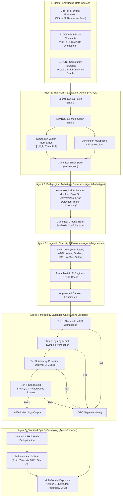

# DRUM-ML: Metrology & RDF-to-LLM Fine-Tuning Pipeline

[](https://www.python.org/downloads/)
[](https://si-digital-framework.org/SI)
[](https://github.com/codata/drum-constants)
[](https://qudt.org/)
[](https://github.com/codata/drum-ml/actions)
[](https://github.com/astral-sh/ruff)
[](LICENSE)
[](LICENSE)
[](https://codata.org/initiatives/task-groups/drum/)

**DRUM-ML** (_Digital Representation of Units of Measurement for Machine Learning_) is an open scientific initiative developed under the **CODATA DRUM ([Digital Representation of Units of Measurement](https://drum.codata.org)) Working Group**, led by **Pascal Heus**.

It is an end-to-end, multi-agent autonomous framework designed to extract, synthesize, augment, validate, and package structured metrological knowledge into high-fidelity fine-tuning datasets for Large Language Models (LLMs).

By extracting semantic graphs from official international metrology authorities and verifying candidates through symbolic algebra and arbitrary-precision arithmetic, DRUM-ML eliminates unit-conversion hallucinations, dimensional errors, and constant misquotations in downstream models.

---

## 👥 Governance & Leadership

- **Lead:** **Pascal Heus** (`pascal@codata.org`)
- **Organization / Task Group:** [**CODATA DRUM Working Group**](https://drum.codata.org) (_Digital Representation of Units of Measurement_, Committee on Data of the International Science Council)
- **Contact:** `drum@codata.org`
- **Mission:** Promoting digital representation, FAIR sharing, and machine-actionable interoperability of units of measurement and fundamental constants for AI/ML systems.
- **Repository:** [https://github.com/codata/drum-ml](https://github.com/codata/drum-ml)

---

## 🌟 Master Knowledge Data Sources

DRUM-ML pulls and synchronizes directly from three authoritative repositories:

| Master Source              | Authority / Focus                                                                                                    | Repository & API                                                                                                                                    | Artifacts Ingested                                                                                                                   |
| -------------------------- | -------------------------------------------------------------------------------------------------------------------- | --------------------------------------------------------------------------------------------------------------------------------------------------- | ------------------------------------------------------------------------------------------------------------------------------------ |
| **The SI Reference Point** | **BIPM** (Bureau International des Poids et Mesures)<br/>Official SI digital representation (9th Ed., 2019 Revision) | [si-digital-framework.org](https://si-digital-framework.org/SI)<br/>[TheBIPM/SI_Digital_Framework](https://github.com/TheBIPM/SI_Digital_Framework) | SI core ontology, exact defining constants ($c, h, e, k, N_{\text{A}}, \Delta\nu_{\text{Cs}}, K_{\text{cd}}$), base units, prefixes. |
| **CODATA DRUM Constants**  | **CODATA / NIST**<br/>Fundamental physical constants with historical re-evaluations (1969–2022)                      | [api.codata.org/drum/constants](https://api.codata.org/drum/constants)<br/>[codata/drum-constants](https://github.com/codata/drum-constants)        | Recommended values, standard uncertainties ($u$), relative uncertainties ($u_r$), correlations.                                      |
| **QUDT 2.1 Reference**     | **QUDT Community**<br/>Broad semantic web graph of units, quantity kinds, dimensions, & conversions                  | [qudt.org](https://qudt.org/)<br/>[qudt/qudt-public-repo](https://github.com/qudt/qudt-public-repo)                                                 | Units vocabulary, quantity kinds, 7-base dimension vectors, non-SI conversion formulas & offsets.                                    |

### Precedence Hierarchy

When entity definitions or conversion factors overlap, DRUM-ML enforces a strict precedence hierarchy:
$$\textbf{Tier 1 (BIPM SI Framework)} \succ \textbf{Tier 2 (CODATA DRUM Constants)} \succ \textbf{Tier 3 (QUDT 2.1)}$$

---

## 🏗️ Multi-Agent Architecture



---

## 🎯 Pedagogical Archetypes

DRUM-ML structures training data across 6 pedagogical task archetypes:

1. **Direct Identification & Symbol Mapping:** Forward and reverse mappings between unit names, official SI/QUDT symbols, quantity kinds, and defining constants.
2. **Dimensional Decomposition & Base SI:** Rigorous derivations expanding derived units into base SI dimensions $[L]^a [M]^b [T]^c [I]^d [\Theta]^e [N]^f [J]^g$.
3. **Conversion Chains, Scaling & Temperature Offsets:** Multi-step conversions, prefix arithmetic (e.g., $\text{nm} \cdot \text{GHz} \to \text{m/s}$), compound unit scaling, and affine temperature offsets ($^{\circ}\text{F} \leftrightarrow ^{\circ}\text{C} \leftrightarrow \text{K}$).
4. **Dimensional Sanity & Error Detection:** Detecting dimensionally inhomogeneous equations ($x = v_0 t + \frac{1}{2} a t^3$), invalid additions across incompatible quantity kinds ($F + E$), and case-sensitive unit traps ($\text{mN}$ vs $\text{MN}$, $\text{mHz}$ vs $\text{MHz}$).
5. **Metrological Tool Use & Serialization:** Translating natural language instructions into SPARQL queries, QUDT/UCUM representations, or executable Python unit code using `pint` or `sympy.physics.units`.
6. **Metrological Uncertainty & GUM Propagation:** Calculating combined standard uncertainty $u_c(y) = \sqrt{\sum (\frac{\partial f}{\partial x_i})^2 u^2(x_i)}$, expanded uncertainty budgets ($U = k \cdot u_c$), and handling SI exact constants ($u=0$).

---

## 🏛️ CODATA DRUM Scientific Unions & Domain Personas

DRUM-ML incorporates dedicated domain personas representing the **30 International Scientific Unions and Standards Bodies** engaged with the CODATA DRUM initiative:

| Disciplinary Sector | Scientific Unions & Standards Organizations | Persona Keys |
|---|---|---|
| **Standards & Policy** | NIST, NRC Canada, International Science Council (ISC) | `nist_metrologist`, `nrc_metrologist`, `isc_science_policy` |
| **Physical & Mathematical** | IUPAP (Physics), IUPAC (Chemistry), IAU (Astronomy), IUCr (Crystallography), IMU (Mathematics), URSI (Radio), IUTAM (Mechanics) | `iupap_physicist`, `iupac_chemist`, `iau_astronomer`, `iucr_crystallographer`, `imu_mathematician`, `ursi_radio_scientist`, `iutam_mechanics_engineer`, `particle_physicist`, `aerospace_propulsion_engineer` |
| **Earth, Space & Environment** | IUGG (Geodesy/Geophysics), IGU (Geography), ISPRS (Remote Sensing), ISDE (Digital Earth), IUSS (Soil Science) | `iugg_geodesist_geophysicist`, `igu_geographer`, `isprs_photogrammetrist`, `isde_digital_earth`, `iuss_soil_scientist`, `energy_environmental_scientist` |
| **Biological & Health** | IUBS (Biology), IUIS (Immunology), IUPHAR (Pharmacology), IUPS (Physiology), IUTOX (Toxicology), IUNS (Nutrition), IUFoST (Food Science), IUPESM/IOMP (Medical Physics), IUPESM/IFMBE (Biomedical Engineering) | `iubs_biologist`, `iuis_immunologist`, `iuphar_pharmacologist`, `iups_physiologist`, `iutox_toxicologist`, `iuns_nutritionist`, `iufost_food_scientist`, `iomp_medical_physicist`, `ifmbe_biomedical_engineer` |
| **Social, Behavioral & Human** | IUPsyS (Psychology), ISA (Sociology), IUSSP (Demography), WAU (Anthropology), 4S (Social Studies of Science), IUHPST (History & Philosophy) | `iupsys_psychologist`, `isa_sociologist`, `iussp_demographer`, `wau_anthropologist`, `four_s_science_studies`, `iuhpst_historian_philosopher` |

---

## 🧠 LLM Model Selection & Performance Guide (Agent 3)

Agent 3 generates natural user queries across **35 Scientific Personas** and **6 Pedagogical Archetypes** while physical answers and derivations are deterministically supplied by Agent 2 and verified by Agent 4.

### 1. Key Selection Criteria
- **Persona Fidelity & Roleplay:** Adopts authentic experimental, observational, or regulatory mindsets without defaulting to high-school phrasing.
- **Zero Conversational Preamble:** Generates direct, prompt-only questions without chatty filler (*"Sure! Here is a question:"*).
- **STEM & Scientific Domain Depth:** Native familiarity with non-SI and domain units (Jansky, Becquerel, Svedberg, Miller indices, geoid, assays).
- **Case & LaTeX Cleanliness:** Preserves case sensitivity ($\text{mN}$ vs $\text{MN}$) and generates valid $\LaTeX$.
- **High Batch Throughput (vLLM):** High tokens-per-second via continuous batching and FlashAttention-2.

### 2. Recommended 3-Tier Spectrum & Hardware Benchmarks (Full 301,314 Samples)

| Tier | Models | **RTX 5090 ($0.42/hr)** | **H100 NVL ($2.70/hr)** | Recommendation |
|---|---|---|---|---|
| **Tier 1 (Fast Test/CI)** | `nemotron-3-nano:4b`, `phi-3.5-mini:3.8b` | **1.05 hours ($0.44 total)** | 36 minutes ($1.62 total) | Prototyping & CI/CD |
| **Tier 2 (Balanced)** | `gemma4:12b`, `qwen2.5:14b` | **2.0 hours ($0.84 total)** | 1.1 hours ($2.97 total) | Balanced local/cloud |
| **Tier 3 (Publication)** | `qwen3.8:27b`, `qwen2.5:32b` | **3.3 hours ($1.38 total)** *(FP8/AWQ)* | 2.4 hours ($6.48 total) *(BF16)* | **Best value for production** |

*(Note: Local Apple Silicon M-series runs at ~60–80 tok/s, suitable for `--limit 100` tests or deterministic `augmenter.enabled: false` mode in <0.1s).*

### 3. Remote Cloud GPU Deployment (Vast.ai / RunPod)

When generating the full 301,314 dataset on cloud GPUs (RTX 5090 / RTX 4090 / H100), the dataset, ontologies, cache, and validation engine **remain 100% on your local machine**. The remote instance acts as a high-speed OpenAI-compatible inference server.

#### Storage Allocation (`--disk`):
| Model Tier | Model Architecture | Minimum Recommended `--disk` |
|---|---|---|
| **Tier 1 (4B)** | `nvidia/NVIDIA-Nemotron-3-Nano-4B-BF16` | **24–35 GB** |
| **Tier 2 (12B–14B)** | `Qwen/Qwen2.5-14B-Instruct` | **45–50 GB** |
| **Tier 3 (27B–32B)** | `Qwen/Qwen2.5-32B-Instruct` | **60–80 GB** |

#### Vast.ai 1-Click Launch Command:
```bash
vastai create instance <OFFER_ID> \
  --image vastai/vllm:v0.27.1-cuda-13.0 \
  --disk 35 \
  --ssh --direct \
  --env '-p 1111:1111 -p 7860:7860 -p 8080:8080 -p 8000:8000 -p 8265:8265 -e OPEN_BUTTON_PORT="1111" -e OPEN_BUTTON_TOKEN="1" -e DATA_DIRECTORY="/workspace/" -e PORTAL_CONFIG="localhost:1111:11111:/:Instance Portal|localhost:7860:17860:/:Model UI|localhost:8000:18000:/docs:vLLM API|localhost:8265:28265:/:Ray Dashboard|localhost:8080:18080:/:Jupyter" -e VLLM_MODEL="nvidia/NVIDIA-Nemotron-3-Nano-4B-BF16" -e VLLM_ARGS="--max-num-seqs 64 --max-model-len 4096 --download-dir /workspace/models --host 127.0.0.1 --port 18000"' \
  --onstart-cmd '# Example json config;echo "--compilation-config '\''{\"cudagraph_capture_sizes\": [1,2,3,4,5,6,7,8]}'\''" > /etc/vllm-args.conf;;;entrypoint.sh;'
```

---

## 🛡️ 4-Tier Metrology Validation & Audit Gate (Agent 4)

- **Tier 1 (LaTeX & Formatting Gate):** Ensures balanced math delimiters (`$`, `$$`), valid LaTeX macros (`\text`, `\frac`, `\cdot`), and clean JSON escaping.
- **Tier 2 (Symbolic Dimensional Gate):** Uses `sympy.physics.units` and `pint` to symbolically verify mathematical equivalence and dimensional balance.
- **Tier 3 (Arbitrary-Precision Decimal Guard):** Uses Python `decimal.Decimal` to verify exact 2019 SI defining constants ($c, h, e, k, N_{\text{A}}, \Delta\nu_{\text{Cs}}, K_{\text{cd}}$) with zero tolerance for floating-point rounding drift.
- **Tier 4 (Code Sandbox Gate):** Parses emitted SPARQL queries via `rdflib` and verifies Python code snippets with `ast.parse`.

### DPO Negative Mining

Any candidate that fails precision, dimensional balance, or case sensitivity is automatically paired with the corrected ground-truth response as `(prompt, chosen, rejected)` for Direct Preference Optimization (DPO).

---

## 📦 Downstream Dataset Formats

- **OpenAI Chat Completion JSONL:** `{"messages": [{"role": "system", ...}, {"role": "user", ...}, {"role": "assistant", ...}]}`
- **ShareGPT Multi-turn JSONL:** `{"conversations": [{"from": "human", ...}, {"from": "gpt", ...}]}`
- **Anthropic Claude JSONL:** `{"messages": [{"role": "user", ...}, {"role": "assistant", ...}]}`
- **DPO Preference JSONL:** `{"prompt": "...", "chosen": "...", "rejected": "...", "rejection_reason": "..."}`
- **Pretraining Stream:** Formatted RDF Turtle, JSON-LD contexts, and metrology textbooks.

---

## 🚀 Quickstart & Installation

### 1. Prerequisites & Toolchain

- **Python 3.12+**
- **uv** package manager
- **Hatchling** build backend

```bash
# Clone the repository
git clone https://github.com/codata/drum-ml.git
cd drum-ml

# Create virtual environment and install with dev dependencies
uv venv
source .venv/bin/activate
uv pip install -e ".[dev]"

# Run code quality & type checks
ruff check .
ruff format --check .
pyrefly check .
pytest tests/
```

### 2. Quick Sample vs. Full Production Run

DRUM-ML provides intuitive zero-configuration commands and quick sampling options:

```bash
# Option A: Quick Sample Run (~30s, 5 entities per category, 1 variation)
drum-ml run --sample

# Option B: Custom Sample Run
drum-ml run --limit 10 --variations 2

# Option C: Full Production Run (processes all BIPM, CODATA & QUDT ontologies)
drum-ml run

# Option D: Pass API Key directly (or set GEMINI_API_KEY / OPENAI_API_KEY / ANTHROPIC_API_KEY)
drum-ml run --api-key "YOUR_KEY_HERE"
```

### 3. Step-by-Step Zero-Config CLI Commands

All commands run with sensible defaults when called without arguments:

```bash
# Step 0: Sync latest master ontologies from BIPM, CODATA DRUM, and QUDT into ./data/raw/
drum-ml fetch-sources

# Step 1: Extract canonical entities with strict precedence (auto-downloads if cache is empty)
drum-ml extract

# Step 2: Generate pedagogical ground-truth scaffolds across all 6 archetypes
drum-ml scaffold
# Or generate a quick sample scaffold:
drum-ml scaffold --sample

# Step 3: Run full pipeline end-to-end (extract -> scaffold -> augment -> validate -> export)
drum-ml run

# Step 4: Evaluate local or remote models against the held-out M-Eval benchmark
drum-ml evaluate
```

### 4. LLM Provider & API Key Configuration

Configure your model provider in `config.yaml` or via environment variables:

| Provider | `config.yaml` Settings | Auth / Environment Variable |
|---|---|---|
| **Google Gemini** | `provider: "google"`<br/>`model: "gemini-2.5-flash"` | `GEMINI_API_KEY` or `GOOGLE_API_KEY` |
| **Local Ollama** | `provider: "ollama"`<br/>`model: "qwen3:8b"`<br/>`api_base: "http://localhost:11434"` | None needed |
| **Local LM Studio** | `provider: "lm_studio"`<br/>`model: "local-model"`<br/>`api_base: "http://localhost:1234/v1"` | None needed |
| **Anthropic Claude** | `provider: "anthropic"`<br/>`model: "claude-3-7-sonnet"` | `ANTHROPIC_API_KEY` |
| **OpenAI** | `provider: "openai"`<br/>`model: "gpt-4.5-preview"` | `OPENAI_API_KEY` |
### 5. Publishing to Hugging Face Hub

DRUM-ML includes built-in commands to publish generated dataset splits, DPO pairs, and generated dataset cards directly to Hugging Face:

```bash
# 1. Login to Hugging Face (or export HF_TOKEN="hf_...")
huggingface-cli login

# 2. Publish dataset splits directly via the DRUM-ML CLI
drum-ml publish-hf --repo-id codata/drum-metrology-instruct --dataset-dir ./dataset

# Optional: Publish as a private repository
drum-ml publish-hf --repo-id codata/drum-metrology-instruct --private

# Alternatively, upload via official huggingface-cli
huggingface-cli upload codata/drum-metrology-instruct ./dataset/ . --repo-type=dataset
```

---

## 📂 Project Directory Structure

```
drum-ml/
├── AGENTS.md                          # Comprehensive Agent & Architecture Specification
├── README.md                          # Project overview & documentation
├── pyproject.toml                     # Python package & build configuration
├── config.yaml                        # Default runtime configuration
├── data/
│   ├── raw/                           # Master source Turtle files (.ttl, .jsonld)
│   │   ├── bipm/                      # BIPM SI Digital Framework TTLs
│   │   ├── codata/                    # CODATA DRUM Constants TTLs & JSON
│   │   └── qudt/                      # QUDT 2.1 Vocabulary TTLs
│   └── cache/                         # SQLite semantic query cache
├── dataset/                           # Final dataset splits & artifacts
│   ├── train.jsonl                    # Supervised Fine-Tuning (SFT) Train split (85%)
│   ├── val.jsonl                      # Validation split (10%)
│   ├── test.jsonl                     # Held-out benchmark test split (5%)
│   ├── dpo_preferences.jsonl          # Mined DPO preference pairs
│   └── dataset_card.md                # Generated dataset card & distribution stats
├── src/
│   └── drum_ml/
│       ├── cli.py                     # Central Typer CLI entrypoint
│       ├── config.py                  # Pydantic Settings & YAML loader
│       ├── data_sources/              # Source fetchers (BIPM, CODATA, QUDT)
│       ├── models/                    # Pydantic Schemas (Entities, Scaffolds, Export)
│       ├── pipeline/                  # Core Agents (Extractor, Scaffolder, Augmenter, Validator, Exporter)
│       ├── symbolic/                  # SymPy, Pint, Decimal precision & LaTeX verifiers
│       └── prompts/                   # Archetype templates & persona definitions
└── tests/                             # Unit, property-based (Hypothesis), & integration tests
```

---

## 🔬 Core Metrological Principle: Quantities vs. Units

In VIM3 (_International Vocabulary of Metrology_), ISO 80000, and QUDT, **Quantities** (and **Quantity Kinds**) and **Units** are distinct ontological categories:

```
┌────────────────────────────────────────────────────────────────────────┐
│                        QUANTITY / QUANTITY KIND                        │
│   • Abstract physical property of a phenomenon, body, or substance     │
│   • Examples: Energy, Torque, Frequency, Absorbed Dose, Temperature    │
│   • Governed by: Dimensional Equations [Q] = L^a M^b T^c ...           │
└───────────────────────────────────┬────────────────────────────────────┘
                                    │
                                    │ expresses / measures
                                    ▼
┌────────────────────────────────────────────────────────────────────────┐
│                                 UNIT                                   │
│   • Real scalar quantity adopted by convention as a reference standard │
│   • Examples: joule (J), newton-metre (N·m), hertz (Hz), gray (Gy)     │
│   • Governed by: Numerical Multipliers & Scale Factors (1 J = 1 N·m)   │
└────────────────────────────────────────────────────────────────────────┘
```

**Why This Distinction Matters for LLM Training:**

1. **Preventing False Dimensional Equivalence:**
   - **Torque** ($\text{N}\cdot\text{m}$) and **Energy** ($\text{J} = \text{N}\cdot\text{m}$) share the dimension $[L^2 M T^{-2}]$, but expressing torque in joules is a severe metrological violation.
   - **Frequency** ($\text{Hz} = \text{s}^{-1}$), **Radioactivity** ($\text{Bq} = \text{s}^{-1}$), and **Angular Velocity** ($\text{rad/s} = \text{s}^{-1}$) share $[T^{-1}]$, but are physically non-interchangeable.
2. **Validating Conversions:** Unit conversions are only valid between units of the **same Quantity Kind**, not just units sharing the same raw dimension vector.

---

## 📦 Local Dataset Storage & Git Exclusion

Generated training datasets and raw semantic dumps are stored locally and **strictly excluded from Git** via `.gitignore`:

```
drum-ml/
├── dataset/                          # <--- FINAL GENERATED SPLITS (Ignored by Git)
│   ├── train.jsonl                   # 85% SFT Train Split (OpenAI Chat format)
│   ├── val.jsonl                     # 10% Validation Split
│   ├── test.jsonl                    # 5% Held-Out Test Benchmark (M-Eval)
│   ├── dpo_preferences.jsonl         # Mined DPO preference pairs (prompt, chosen, rejected)
│   └── dataset_card.md               # Summary metrics, distributions, and unit coverage
└── data/                             # <--- INTERMEDIATE CACHES (Ignored by Git)
    ├── raw/                          # Downloaded master ontologies (BIPM, CODATA, QUDT)
    ├── cache/llm_cache.sqlite        # SQLite semantic cache (avoids redundant API calls)
    ├── entities.json                 # Unified canonical entity store
    ├── scaffolds.json                # Ground-truth pedagogical templates
    └── augmented.json                # Persona-augmented candidate drafts
```

---

## 🏋️ Training Recipes with Existing Models

The generated datasets in `./dataset/` are ready for supervised fine-tuning (SFT) and Direct Preference Optimization (DPO).

### Option 1: Local Fine-Tuning on Mac via Apple MLX (`mlx-lm`)

For training locally on Apple Silicon (e.g. Qwen 2.5, Llama 3.1, or Gemma 2):

```bash
# 1. Install MLX LM
pip install mlx-lm

# 2. Supervised Fine-Tuning (SFT LoRA)
python -m mlx_lm.lora \
    --model mlx-community/Qwen2.5-14B-Instruct-4bit \
    --data ./dataset/ \
    --train \
    --batch-size 4 \
    --iters 1000 \
    --adapter-path ./adapters/drum-sft-qwen14b

# 3. Direct Preference Optimization (DPO Alignment)
python -m mlx_lm.dpo \
    --model ./adapters/drum-sft-qwen14b \
    --data ./dataset/ \
    --train \
    --adapter-path ./adapters/drum-dpo-qwen14b
```

### Option 2: GPU Cluster / Cloud Training via Hugging Face TRL & Unsloth

For training on NVIDIA GPUs (A100 / H100 / RTX 4090):

```python
from datasets import load_dataset
from trl import SFTTrainer, DPOTrainer
from transformers import TrainingArguments

# Load the local DRUM-ML splits
train_ds = load_dataset("json", data_files={"train": "./dataset/train.jsonl", "validation": "./dataset/val.jsonl"})

# Run SFT LoRA fine-tuning
trainer = SFTTrainer(
    model="meta-llama/Llama-3.1-8B-Instruct",
    train_dataset=train_ds["train"],
    eval_dataset=train_ds["validation"],
    dataset_text_field="messages",
    max_seq_length=2048,
    args=TrainingArguments(output_dir="./drum-llama3-sft", per_device_train_batch_size=4, num_train_epochs=3),
)
trainer.train()

# Run DPO alignment
dpo_ds = load_dataset("json", data_files="./dataset/dpo_preferences.jsonl")
dpo_trainer = DPOTrainer(
    model="./drum-llama3-sft",
    train_dataset=dpo_ds["train"],
    args=TrainingArguments(output_dir="./drum-llama3-dpo", per_device_train_batch_size=2),
)
dpo_trainer.train()
```

### Option 3: Managed Cloud Fine-Tuning (OpenAI / Together AI)

```bash
# Upload and launch fine-tuning on OpenAI API
openai api fine_tuning.jobs.create \
  -t ./dataset/train.jsonl \
  -v ./dataset/val.jsonl \
  -m gpt-4o-mini-2024-07-18
```

---

## 🧪 DRUM Metrology Benchmark (M-Eval)

The **DRUM Metrology Benchmark** is a standardized evaluation suite testing LLMs across **6 Core Sub-Disciplines**:
1. **Fundamental Physical Constants & SI 2019** (`constants`)
2. **Dimensional Decomposition & Base SI** (`dimensions`)
3. **Unit Conversions & Affine Transformations** (`conversions`)
4. **Error Detection & Dimensional Homogeneity** (`homogeneity`)
5. **SI Typography & Metrological Conventions** (`conventions`)
6. **Metrological Uncertainty (GUM) & Sig-Figs** (`uncertainty`)

### 1. Build Benchmark Datasets

```bash
# Build 50 samples per task (MCQ Track A + Free-Form Track B)
drum-ml build-benchmark \
    --entities-file ./data/entities.json \
    --output-dir ./dataset/benchmark \
    --samples-per-task 50
```

### 2. Evaluate Models & Generate Scorecards

```bash
# Evaluate baseline model
drum-ml evaluate \
    --benchmark-file ./dataset/benchmark/drum_benchmark_mcq.jsonl \
    --model-endpoint http://localhost:1234/v1 \
    --model-name qwen2.5-14b-base \
    --output ./dataset/benchmark/base_report.json

# Evaluate fine-tuned model (measure error reduction)
drum-ml evaluate \
    --benchmark-file ./dataset/benchmark/drum_benchmark_mcq.jsonl \
    --model-endpoint http://localhost:1234/v1 \
    --model-name qwen2.5-14b-drum-finetuned \
    --output ./dataset/benchmark/finetuned_report.json
```

### 3. Stratified Scorecard

```text
       DRUM Metrology Benchmark Scorecard: qwen2.5-14b-drum-finetuned
┏━━━━━━━━━━━━━━━━━━━━━━━━━━━━━━━━━━━━━━━━┳━━━━━━━━━┳━━━━━━━━┳━━━━━━━━━━┓
┃ Category / Sub-Discipline              ┃ Samples ┃ Passed ┃ Accuracy ┃
┡━━━━━━━━━━━━━━━━━━━━━━━━━━━━━━━━━━━━━━━━╇━━━━━━━━━╇━━━━━━━━╇━━━━━━━━━━┩
│ 1. Fundamental Constants & SI 2019     │      50 │     49 │    98.0% │
│ 2. Dimensional Decomposition & Base SI │      50 │     46 │    92.0% │
│ 3. Unit Conversions & Affine Offsets   │      50 │     48 │    96.0% │
│ 4. Error Detection & Homogeneity       │      50 │     44 │    88.0% │
│ 5. SI Typography & Metrological Rules  │      50 │     45 │    90.0% │
│ 6. Metrological Uncertainty (GUM)      │      50 │     41 │    82.0% │
├────────────────────────────────────────┼─────────┼────────┼──────────┤
│ OVERALL DRUM BENCHMARK SCORE           │     300 │    273 │   91.00% │
└────────────────────────────────────────┴─────────┴────────┴──────────┘
```

---

## 📜 Standards & References

- **BIPM SI Brochure (9th Edition, 2019 Revision):** [https://www.bipm.org/en/publications/si-brochure](https://www.bipm.org/en/publications/si-brochure)
- **BIPM SI Digital Framework:** [https://si-digital-framework.org/SI](https://si-digital-framework.org/SI)
- **CODATA Fundamental Constants (DRUM):** [https://github.com/codata/drum-constants](https://github.com/codata/drum-constants)
- **QUDT Ontologies:** [https://qudt.org/](https://qudt.org/)
- **NIST SP 811:** _Guide for the Use of the International System of Units (SI)_
- **JCGM 100:2008 (GUM):** _Evaluation of measurement data — Guide to the expression of uncertainty in measurement_

---

## 📄 License & Attribution

DRUM-ML is an open-access scientific initiative developed under the **CODATA DRUM Working Group** and led by **Pascal Heus**.

It is distributed under a dual open-license structure:

- **Software & Code (`src/`, `tests/`, CLI):** Licensed under the **[MIT License](LICENSE)**.
- **Datasets & Generated Corpora (`dataset/`, `data/`):** Licensed under the **[Creative Commons Attribution 4.0 International (CC BY 4.0)](https://creativecommons.org/licenses/by/4.0/)** License.

See the full [LICENSE](LICENSE) file for complete terms.
